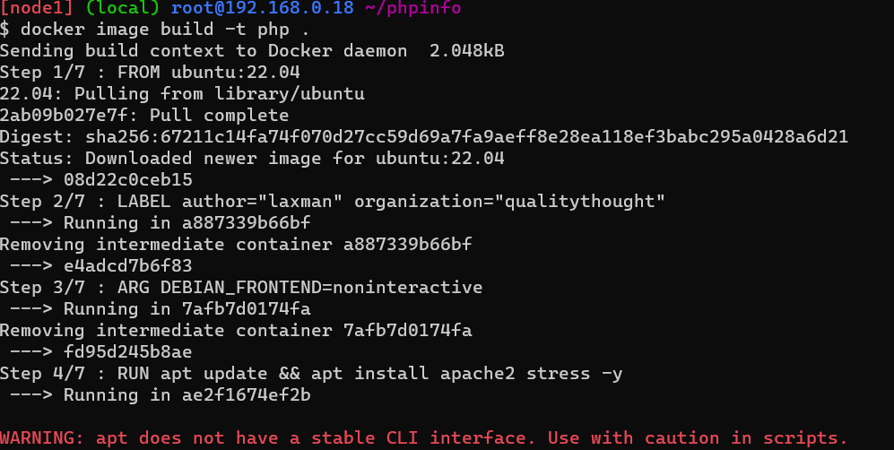
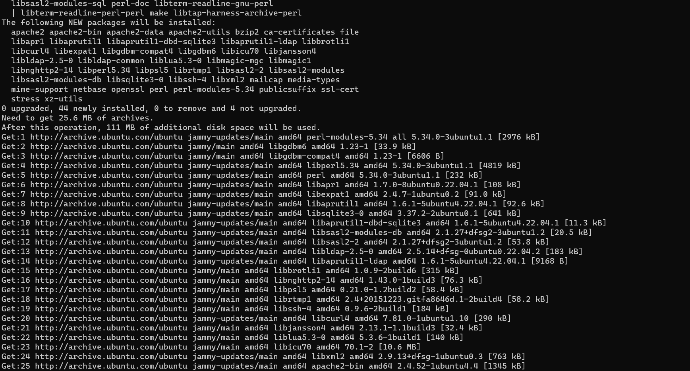
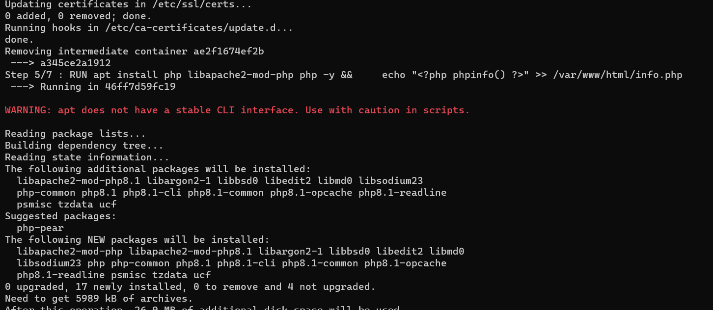
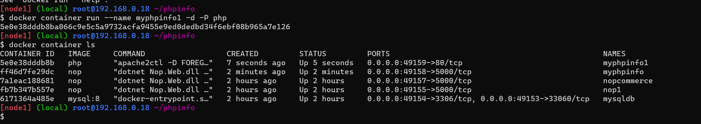
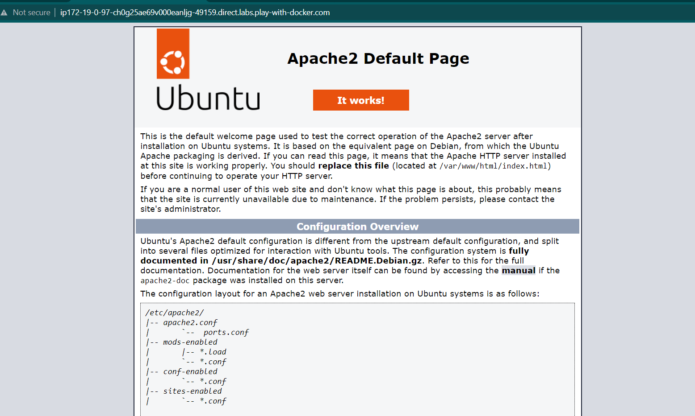
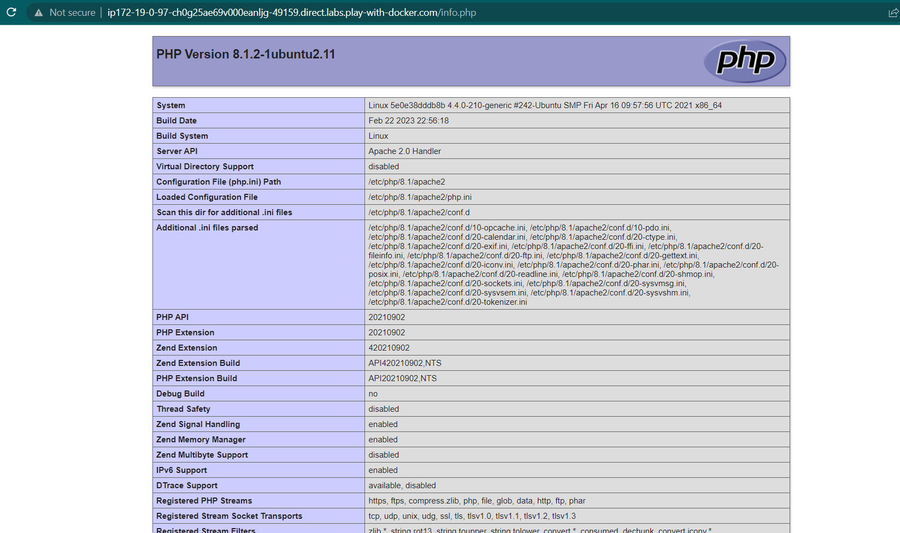

### Apache and phpinfo image - container  build
* Take one instance in Docker Playground 
* In these content write on `vi Dockerfile`
```Dockerfile
FROM ubuntu:22.04
LABEL author="laxman" organization="qualitythought"
ARG DEBIAN_FRONTEND=noninteractive
RUN apt update && apt install apache2 stress -y
RUN apt install php libapache2-mod-php php -y && \
    echo "<?php phpinfo() ?>" >> /var/www/html/info.php
EXPOSE 80
CMD ["apache2ctl","-D", "FOREGROUND"]
``` 
* Use thesee command `docker image build -t php .` to create image 



* Use these command to create container `docker container run --name myphpinfo -d -P nop`


* Then in this server url we add /info.php



